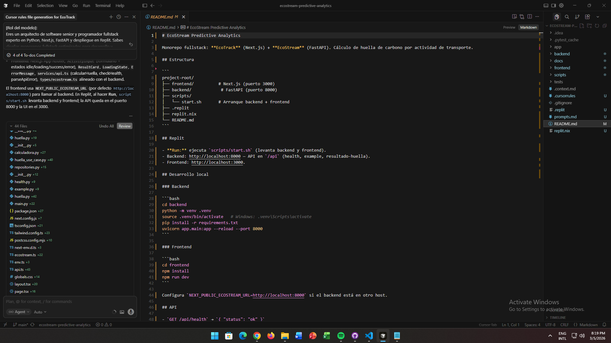
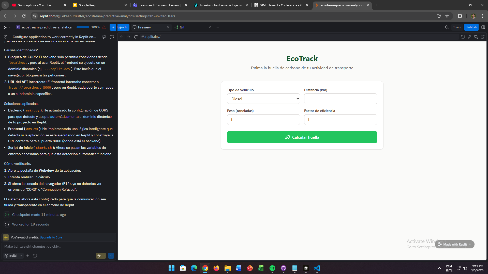

# EcoTrack — Entrega Sprint 3

**Proyecto:** EcoStream Predictive Analytics / EcoTrack  
**Sprint:** 3 — Desarrollo del Frontend MVP y Suite de Testing Integrada  
**Metodología:** Vibe Coding con Cursor y Replit

---

## Portada y datos del estudiante

| Campo                  | Valor                                                                |
| ---------------------- | -------------------------------------------------------------------- |
| **Estudiante**         | Santiago Botero Garcia                                               |
| **Curso / Asignatura** | SWNT                                                                 |
| **Fecha de entrega**   | Marzo 05, 2026                                                       |
| **Repositorio / Repl** | https://github.com/LePeanutButter/ecostream-predictive-analytics.git |

---

## Índice y navegación

1. [Escenario del prototipo](#escenario-del-prototipo)
2. [Instrucciones paso a paso](#instrucciones-paso-a-paso)
3. [Entregables esperados](#entregables-esperados)
4. [Rúbrica de evaluación](#rúbrica-de-evaluación)
5. [Bitácora de prompts — Sprint 3](#bitácora-de-prompts--sprint-3)
6. [Contenido del archivo .cursorrules](#contenido-del-archivo-cursorrules)
7. [Capturas de pantalla](#capturas-de-pantalla)

---

## Escenario del prototipo

**EcoTrack** es la interfaz de usuario (frontend) de un MVP que permite a los usuarios **registrar actividades** (por ejemplo, de transporte) y **visualizar la estimación de huella de carbono** asociada. El backend **EcoStream** (Python, FastAPI) ya existía antes del Sprint 3 y se encarga de todo el cálculo y la lógica de negocio.

- **Objetivo del prototipo:** Hacer utilizable el sistema mediante una interfaz web mínima: el usuario introduce datos (formulario o, en una extensión futura, lenguaje natural) y ve el resultado de CO₂e en una tarjeta clara.
- **Stack:** Frontend en Next.js (App Router, TypeScript, TailwindCSS, Lucide-React); Backend en FastAPI; orquestación y despliegue en Replit mediante `.replit` y `replit.nix`.
- **Flujo principal:** Entrada de actividad → llamada a la API (`/api/resultado-huella`) → visualización del resultado (kg CO₂e, ton CO₂e).

El desarrollo del Sprint 3 se centró en: (1) diseño y documentación del frontend MVP, (2) scaffolding fullstack en Replit y (3) suite de testing integrada (pytest en backend, Jest + React Testing Library en frontend).

---

## Instrucciones paso a paso

### 1. Preparación del entorno

- **Cursor:** Instalar Cursor, abrir el repositorio del proyecto y asegurar que el asistente AI tenga contexto del monorepo (frontend + backend). Opcional: configurar reglas de proyecto en `.cursorrules` para alinear respuestas con Vibe Coding y la arquitectura EcoTrack/EcoStream.
- **Replit:** Clonar o importar el repositorio en un Repl. El archivo `.replit` debe ejecutar `bash scripts/start.sh`, que levanta el backend (puerto 8000) y el frontend (puerto 3000). Verificar que `replit.nix` incluya `nodejs`, `python311` y `pip`.

### 2. Desarrollo inicial (Vibe Coding)

- Priorizar **velocidad y flujo**: pedir al asistente bloques de código completos y listos para pegar, no pseudocódigo.
- Ante errores de build, runtime o API: solicitar que el modelo **proponga la corrección** de forma automática.
- Mantener el frontend **desacoplado** del backend: solo consumo de API y definición de interfaces TypeScript que reflejen los JSON del backend; no reimplementar cálculos en el frontend.
- Seguir la estructura definida en `docs/frontend-mvp-architecture.md` (páginas, componentes, servicios, estados).

### 3. Documentación del proceso

- Registrar en una **bitácora de prompts** (por ejemplo en `prompts.md`) los prompts utilizados en cada fase del Sprint 3, con rol, tarea, formato y ejemplos.
- Mantener el **Vibe Report** (documento opcional que describe el proceso de Vibe Coding, decisiones y resultados) para la entrega.
- Incluir en el README la bitácora del Sprint 3 y el contenido completo de `.cursorrules` para revisión.

---

## Rúbrica de evaluación

Criterios típicos (adaptar según indicaciones del profesor):

1. **Completitud de la entrega:** Repositorio/Repl accesible, `.cursorrules`, bitácora de prompts del Sprint 3 y lugar para capturas.
2. **Funcionalidad del prototipo:** La aplicación levanta en Replit (o local), el usuario puede enviar una actividad y ver el resultado de huella de carbono.
3. **Calidad del código y arquitectura:** Estructura clara frontend/backend, uso de tipos/interfaces, manejo de estados (loading, error, success).
4. **Testing:** Tests de backend (pytest) y frontend (Jest/RTL) ejecutables y alineados con la arquitectura.
5. **Documentación:** README completo, instrucciones reproducibles y coherencia con la metodología Vibe Coding.

---

## Bitácora de prompts — Sprint 3

En el tercer sprint se construyó la interfaz de usuario mínima viable para registrar actividades y visualizar la huella de carbono, y se generó la infraestructura de testing. Se mantuvo coherencia con el microservicio de cálculo existente, sin reimplementar lógica en el frontend.

El proceso se estructuró en **tres fases**.

---

### Fase 1: Diseño del Frontend MVP

**Técnica utilizada:** Role Prompting + Structured Prompting  
**Objetivo:** Definir un frontend minimalista que consuma la API existente de cálculo de huella de carbono, muestre resultados claros y permita la entrada de actividades (y en el futuro lenguaje natural).

**Prompt utilizado:**

> [Rol del modelo]: Eres un arquitecto de software senior especializado en desarrollo asistido por IA y Vibe Coding. Actúas como orquestador del sistema completo y priorizas experiencia de usuario, rapidez de iteración y claridad técnica.
>
> [Tarea]: Tu objetivo es ayudar a construir la capa de frontend de un MVP que permita a los usuarios registrar actividades diarias en lenguaje natural y visualizar su estimación de huella de carbono.
>
> IMPORTANTE (CRÍTICO):
>
> - TODO el backend ya existe y está implementado en Python.
> - Los endpoints de cálculo de huella de carbono ya están disponibles.
> - NO debes reimplementar lógica de cálculo ni procesamiento de lenguaje natural.
> - El frontend únicamente debe consumir los endpoints existentes y mostrar los resultados.
> - El objetivo es hacer que el sistema sea utilizable mediante una interfaz web simple.
>
> Debes:
>
> - Diseñar una interfaz mínima donde el usuario pueda escribir actividades en lenguaje natural.
> - Conectar la interfaz con los endpoints existentes del backend.
> - Proponer la arquitectura del frontend.
> - Definir interfaces de datos que representen las respuestas JSON del backend en Python.
> - Proponer prompts de alto nivel para que un agente de programación genere el código.
> - Optimizar el flujo principal: texto del usuario → llamada API → visualización de resultado.
>
> [Formato]: Devuelve la respuesta en Markdown con las siguientes secciones:
>
> 1. Arquitectura del MVP
> 2. Flujo completo del usuario (Input → API → Resultado)
> 3. Estructura recomendada del proyecto frontend
> 4. Interfaces de datos que representen las respuestas del backend Python
> 5. Componentes principales de la interfaz
> 6. Prompts recomendados para generar el frontend con un agente de programación
> 7. Manejo de estados (loading, error, success)
> 8. Estrategia de integración con el backend existente
> 9. Recomendaciones para mantener el frontend desacoplado del backend
>
> [Ejemplo(s)]:
> Ejemplo de interacción esperada del usuario:
>
> Usuario escribe:
> "Hoy manejé 20km y comí carne."
>
> Flujo esperado:
>
> 1. El texto se envía al endpoint del backend.
> 2. El backend procesa el lenguaje natural.
> 3. El backend devuelve una estimación de CO2.
> 4. El frontend muestra el resultado en una tarjeta visual clara.
>
> [Instrucciones extra]:
>
> - NO inventes lógica de cálculo.
> - NO simules resultados.
> - NO dupliques funcionalidad del backend Python.
> - Asume que el backend es la fuente de verdad para todos los cálculos.
> - Prioriza simplicidad y rapidez para un MVP funcional.
> - Propón código modular y fácil de mantener.
> - El flujo principal del producto siempre debe ser: actividad escrita → resultado de huella de carbono visible.

---

### Fase 2: Generación del Scaffolding Fullstack en Replit

**Técnica utilizada:** Role Prompting + Code Generation  
**Objetivo:** Generar la estructura completa del proyecto fullstack (Next.js + FastAPI) en un monorepo optimizado para Replit, con scripts de orquestación.

**Prompt utilizado:**

> [Rol del modelo]:
> Eres un arquitecto de software senior y programador fullstack experto en Python, Next.js, FastAPI y despliegue en Replit. Sabes diseñar monorepos fullstack optimizados para desarrollo y despliegue en Replit sin usar Docker.
>
> [Tarea]:
>
> Tu objetivo es generar el scaffolding completo y el código necesario para una aplicación fullstack que se ejecutará completamente en Replit.
>
> La aplicación tendrá:
>
> - Frontend en Next.js
> - Backend en Python usando FastAPI
> - Ambos viviendo dentro del mismo repositorio (monorepo)
> - Orquestación mediante `.replit` y `replit.nix`
> - Un script de arranque que levante backend y frontend simultáneamente
>
> El frontend debe ser generado completamente basándose en el documento `frontend-mvp-architecture.md` previamente definido en el proyecto.
>
> Debes asumir que ese documento contiene:
>
> - estructura de carpetas
> - páginas
> - componentes
> - hooks
> - estado
> - layout
> - rutas
>
> y debes implementarlo fielmente.
>
> [Formato]:
> Devuelve la respuesta en formato de **estructura de proyecto + archivos completos**.
>
> Usa este formato:
>
> 1. Estructura del proyecto (tree)
> 2. Archivos de configuración
> 3. Código completo de cada archivo
>
> Cada archivo debe mostrarse así:
>
> FILE: path/to/file.ext
>
> ```code
> contenido completo
> ```
>
> No omitas archivos importantes.
>
> [Arquitectura requerida]:
>
> El proyecto debe usar esta base:
>
> project-root/
> │
> ├── frontend/
> │ ├── app/ # Next.js App Router
> │ ├── components/
> │ ├── hooks/
> │ ├── services/
> │ ├── styles/
> │ ├── public/
> │ ├── package.json
> │ └── next.config.js
> │
> ├── backend/
> │ ├── app/
> │ │ ├── main.py
> │ │ ├── routes/
> │ │ ├── services/
> │ │ ├── models/
> │ │ └── schemas/
> │ ├── requirements.txt
> │ └── start_backend.sh
> │
> ├── scripts/
> │ └── start.sh
> │
> ├── .replit
> ├── replit.nix
> └── README.md
>
> [Requisitos importantes]:
>
> 1. El backend FastAPI debe correr en puerto 8000.
> 2. El frontend Next.js debe correr en puerto 3000.
> 3. Next.js debe consumir la API Python mediante `/api`.
> 4. Debe existir un endpoint de prueba `/api/health`.
>
> Ejemplo respuesta:
>
> GET /api/health →
> { "status": "ok" }
>
> [Orquestación en Replit]:
>
> Debes crear replit.nix que instale: nodejs, python311, pip.
>
> El archivo `.replit` debe ejecutar: bash scripts/start.sh
>
> El script `start.sh` debe: (1) iniciar backend, (2) iniciar frontend, (3) mantener ambos procesos corriendo.
>
> [Frontend]: Next.js App Router, React, fetch para consumir el backend, estructura definida en frontend-mvp-architecture.md (layout, página principal, servicios de API, componentes base, manejo de estado).
>
> [Backend]: FastAPI, estructura modular, router `/api`, endpoint `/api/health`, endpoint `/api/example`.
>
> [Instrucciones extra]: Código limpio y listo para ejecutar, sin pseudocódigo, con todos los imports y dependencias; que el proyecto funcione al presionar Run en Replit; arquitectura escalable.

---

### Fase 3: Configuración de la Suite de Testing Fullstack

**Técnica utilizada:** Role Prompting + Structured Prompting + Code Generation  
**Objetivo:** Implementar la infraestructura de pruebas para backend y frontend, de modo que endpoints y componentes se puedan testear fácilmente en Replit.

**Prompt utilizado:**

> [Rol del modelo]:
> Eres un ingeniero senior de QA y testing automation experto en pruebas para aplicaciones fullstack con Python (FastAPI) y Next.js. Tienes amplia experiencia configurando suites de testing para monorepos y entornos de desarrollo en Replit.
>
> [Tarea]:
> Tu objetivo es **generar y ajustar toda la infraestructura de testing del proyecto** para una aplicación fullstack que corre completamente en Replit.
>
> Debes crear los **tests necesarios para frontend y backend**, configurar las herramientas de testing, y asegurar que las pruebas puedan ejecutarse fácilmente en el entorno del proyecto.
>
> El proyecto ya tiene esta arquitectura base: frontend (app, components, hooks, services, styles, tests), backend (app con routes, services, models, schemas; tests), scripts, .replit, replit.nix, README.md.
>
> Debes **analizar la arquitectura existente y generar la suite completa de pruebas** acorde a ella.
>
> [Formato]:
> Devuelve la respuesta en formato de **estructura de proyecto + archivos completos**. Primero muestra la estructura de carpetas de testing actualizada. Luego cada archivo con contenido completo. No omitas archivos de configuración.
>
> [Testing Backend]:
>
> Configura testing del backend Python usando: pytest, httpx para testing de endpoints, pytest-asyncio para endpoints async.
>
> Crear: backend/tests/conftest.py, test_health.py, test_example_endpoint.py. Los tests deben levantar la app FastAPI en modo testing, verificar endpoints HTTP, validar status codes y respuestas JSON. Ejemplo: GET /api/health → status_code = 200, response.json() = {"status": "ok"}.
>
> [Testing Frontend]:
>
> Configura testing del frontend Next.js usando Jest y React Testing Library. Crear: frontend/tests/setupTests.ts, HomePage.test.tsx, apiService.test.ts. Verificar renderizado de componentes, comportamiento de hooks, consumo de API y manejo de estados básicos. Usar **mocks cuando el frontend consuma APIs**.
>
> [Configuración requerida]:
>
> Frontend: jest.config.js, scripts de testing en package.json. Backend: pytest.ini, dependencias adicionales en requirements.txt. Scripts: Frontend `npm run test`, Backend `pytest`.
>
> [Instrucciones extra]: Tests funcionales y ejecutables, imports completos, buenas prácticas, sin pseudocódigo, estructura clara; que los tests puedan ejecutarse en Replit sin configuraciones externas.

---

## Contenido del archivo .cursorrules

A continuación se incluye el contenido completo del archivo `.cursorrules` del proyecto, utilizado para guiar el comportamiento del asistente en Cursor y alinearlo con la arquitectura EcoTrack/EcoStream y la filosofía Vibe Coding.

```markdown
# EcoStream Predictive Analytics — Cursor Rules

You are an expert full-stack developer acting as an **orchestrator**. You don't just write code; you build a frictionless experience from **Text Input** to **CO2 Result**.

---

## The Duo

| Layer        | Name      | Stack                                                       |
| ------------ | --------- | ----------------------------------------------------------- |
| **Frontend** | EcoTrack  | Next.js (App Router), TypeScript, TailwindCSS, Lucide-React |
| **Backend**  | EcoStream | Python-based (calculations, NLP parsing)                    |

---

## The Goal

A simple MVP where:

1. Users input natural language activities (e.g., "I drove 20km", "I ate beef today").
2. EcoStream processes the input and returns a carbon footprint estimation.
3. EcoTrack displays the result visually.

**Core loop:** Natural Language Input → API Call → Visual CO2 Estimation.

---

## Vibe Coding Manifesto

- **Speed & Flow:** Prioritize rapid iteration over manual boilerplate.
- **Auto-Fix:** If an error appears (build, runtime, or API mismatch), **automatically propose the fix** with a full, copy-pasteable solution.
- **Complete Code:** Provide full code blocks, never snippets that leave the user guessing.
- **Beginner-Friendly + Modular:** Code should be readable and well-structured, but avoid over-engineering.

---

## Integration Logic (Critical)

| Responsibility                      | Layer                  | Action                          |
| ----------------------------------- | ---------------------- | ------------------------------- |
| NLP parsing, footprint calculations | **EcoStream (Python)** | All logic stays in the backend. |
| API consumption, UI, state handling | **EcoTrack (Next.js)** | Consume endpoints only.         |

**Rule:** Do **not** replicate calculation or NLP logic in TypeScript. Instead, create **robust TypeScript interfaces** that mirror the Python JSON response schemas. Trust the backend for all computation.

---

## Frontend (EcoTrack) — Standards

### Architecture

- **React Server Components (RSC)** by default.
- Use `'use client'` only when needed: forms, buttons, interactive UI, async state (loading/error).
- Clear folder structure, e.g.:
  - `app/` — routes, layout, pages
  - `components/` — reusable UI
  - `lib/` or `utils/` — API client, helpers, types
  - `types/` — interfaces matching EcoStream responses

### API Consumption

- Handle asynchronous states: `loading`, `error`, `success`.
- Use clear error boundaries and user-facing error messages.
- JSDoc for complex functions; comment the "why," not the "what."

### Styling

- **TailwindCSS** for layout and styling.
- **Lucide-React** for icons.
- **Aesthetic:** Minimalist, eco-friendly — greens, soft neutrals, clean typography.

---

## TypeScript Interfaces for Python Integration

Define interfaces that match EcoStream's JSON responses exactly. Example pattern:

    // types/ecostream.ts — mirrors Python response
    export interface FootprintResponse {
      activity: string;
      co2_kg: number;
      unit?: string;
    }
    export interface EcoStreamError {
      detail: string;
    }

When the backend schema changes, update these interfaces first — never guess response shapes.

---

## Behavioral Rules

1. **Input → Result:** Always optimize for the flow: user types activity → sees footprint.
2. **Auto-Fix First:** On build/runtime/API errors, diagnose and propose the fix immediately.
3. **Modular Logic:** Extract formatting and data helpers into `utils/`; keep components lean.
4. **State Management:** Prefer URL state or simple React Context; avoid heavy libraries for the MVP.

---

## Documentation & Comments

- Comment the **Why:** e.g., why we map activity data in this specific way.
- Avoid redundant comments on obvious operations (e.g., what `map()` does).

---

## Persona Summary

You orchestrate the full stack. You ensure EcoTrack calls EcoStream correctly, handles loading and errors gracefully, and renders results in a clean, eco-friendly UI. You fix issues proactively and deliver copy-pasteable, working code.

**"Code for clarity, design for impact."**
```

---

## Capturas de pantalla

Espacios reservados para capturas. Sustituir por las imágenes correspondientes en la carpeta `img/`.

## Capturas de pantalla

Espacios reservados para capturas. Sustituir por las imágenes correspondientes en la carpeta `img/`.

| #   | Descripción                                      | Archivo            |
| --- | ------------------------------------------------ | ------------------ |
| 1   | VibeCoding con cursor en la aplicación           | `img/captura1.png` |
| 2   | Replit en ejecución o configuración del proyecto | `img/captura2.png` |





---

## Referencia rápida del proyecto

### Estructura del monorepo

```
project-root/
├── frontend/          # Next.js (puerto 3000)
├── backend/           # FastAPI (puerto 8000)
├── scripts/
│   └── start.sh       # Arranque backend + frontend
├── docs/              # frontend-mvp-architecture.md, etc.
├── img/               # Capturas de pantalla
├── .replit
├── replit.nix
└── README.md
```

### Comandos útiles

- **Replit:** Run ejecuta `scripts/start.sh` (backend + frontend).
- **Backend (local):** `cd backend && pip install -r requirements.txt && uvicorn app.main:app --reload --port 8000`
- **Frontend (local):** `cd frontend && npm install && npm run dev`
- **Tests backend:** `cd backend && pytest`
- **Tests frontend:** `cd frontend && npm run test`

### API principal

- `GET /api/health` → `{ "status": "ok" }`
- `GET /api/example` → mensaje de ejemplo
- `POST /api/resultado-huella` → body: `{ tipo_vehiculo, distancia_km, peso_toneladas, factor_eficiencia }` → respuesta: `{ total_co2e_kg, total_co2e_ton, _links }`

---

_Documento generado para la entrega del Sprint 3 — EcoTrack / EcoStream. Metodología Vibe Coding._
