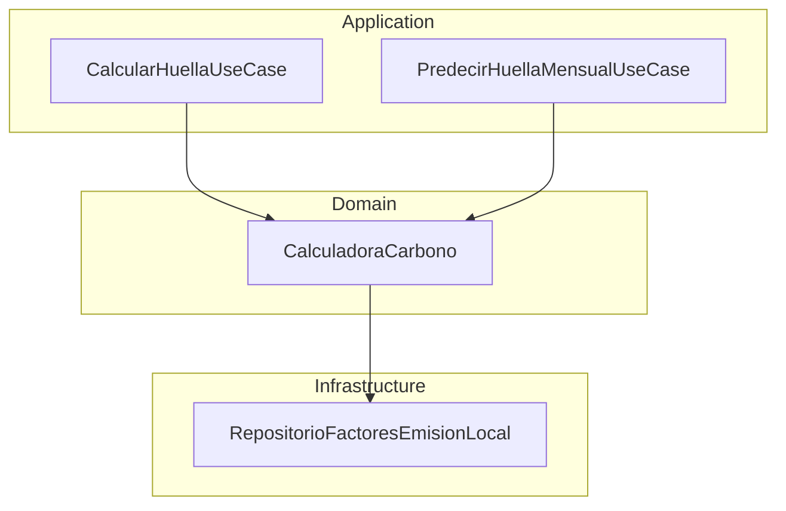

# Proyecto Integrador Final: Optimización del SDLC con IA Generativa

## EcoStream - Módulo de Análisis Predictivo

---

## 1. Escenario del Caso de Estudio: EcoStream

EcoStream es una startup que desarrolla una plataforma SaaS para la gestión de huella de carbono en empresas industriales. Este proyecto implementa un **Módulo de Análisis Predictivo** que complementa el microservicio de cálculo de huella de carbono asociada al transporte de mercancías.

Se ha aplicado una estrategia integral de **Ingeniería de Prompts** que cubre todo el Ciclo de Desarrollo de Software (SDLC) para este módulo, demostrando cómo el uso estratégico de LLMs acelera la definición, el diseño, la codificación y las pruebas, manteniendo calidad y seguridad.

---

## 2. Entregables

### 2.1 Bitácora de Prompts

### Fase 1: Análisis y Planificación (Módulos 1-2)

**Técnica:** System Prompt & Few-Shot Prompting.
**Objetivo:** Definir el comportamiento del agente y generar requisitos precisos basados en ejemplos.

**Prompt:**

> [Rol del modelo]: Eres un(a) Analista de Negocios Senior en EcoStream.
> [Tarea]: Generar 5 requisitos funcionales para el nuevo Módulo Predictivo que complemente el actual microservicio de cálculo de transporte.
> [Formato]: Lista numerada.
> [Ejemplo(s)]:
>
> 1. El sistema debe predecir el impacto de cambiar la flota de vehículos DIESEL a ELÉCTRICO basándose en los factores de emisión actuales (2.68 vs 0.12).
> 2. El módulo debe alertar cuando la eficiencia real reportada se desvíe más de un 15% del `factor_eficiencia` promedio histórico.
>    [Instrucciones extra]: Asegúrate de que los requisitos mencionen las entidades existentes como `ActividadTransporte` y `TipoVehiculo`.

---

### Fase 2: Arquitectura y Diseño (Módulo 3)

**Técnica:** Chain-of-Thought (CoT).
**Objetivo:** Desglosar el razonamiento arquitectónico para garantizar escalabilidad y seguridad.

**Prompt:**

> [Rol del modelo]: Eres un(a) Arquitecto/a de Software Cloud.
> [Tarea]: Diseñar la expansión de la arquitectura actual para integrar el módulo predictivo.
> [Formato]: Explicación lógica CoT y diagrama Mermaid.
> [Instrucciones extra]:
>
> 1. Analiza cómo el nuevo servicio predictivo consumirá el `RepositorioFactoresEmisionLocal`.
> 2. Propón una capa de persistencia para guardar los `ResultadoHuella` históricos.
> 3. Mantén el patrón de Inyección de Dependencias manual observado en tu punto de entrada (`app.py` o `main.py`).
> 4. Explica cómo desacoplar el cálculo en tiempo real de las proyecciones a largo plazo.

---

### Fase 3: Generación de Código y Refactorización (Módulos 4-5)

**Técnica:** Role Play y Delimitadores.
**Objetivo:** Obtener código limpio y optimizar fragmentos existentes.

**Prompt de Generación (Boilerplate):**

> [Rol del modelo]: Eres un(a) Desarrollador/a Backend Senior.
> [Tarea]: Crear el caso de uso `PredecirHuellaMensualUseCase` siguiendo la estructura del código actual.
> [Formato]: Bloque de código Python.
> [Instrucciones extra]:
>
> - Usa la entidad `ActividadTransporte` y el servicio `CalculadoraCarbono` ya definidos.
> - Implementa la lógica para recibir un listado de actividades proyectadas y devolver un acumulado.
> - Respeta el uso de `dataclasses` y el manejo de excepciones como `ValorInvalidoException`.

**Prompt de Refactorización:**

> [Rol del modelo]: Eres un(a) Especialista en Clean Code.
> [Tarea]: Refactorizar el método `calcular` de la clase `CalculadoraCarbono` para soportar cálculos masivos.
> [Formato]: Código original vs Refactorizado.
> [Instrucciones extra]: Actualmente el código hace el cálculo uno a uno. Optimízalo para recibir una lista de `ActividadTransporte` y devolver una lista de `ResultadoHuella` usando listas por comprensión o Map/Reduce para mejorar el rendimiento.

---

### Fase 4: Testing, Seguridad y Documentación (Módulos 6-7)

**Técnica:** Red Teaming y Adversarial Prompting.
**Objetivo:** Garantizar la calidad del software y la protección contra ataques.

**Prompt de Testing (Unit Tests):**

> [Rol del modelo]: Eres un(a) Ingeniero/a de QA Automation.
> [Tarea]: Crear pruebas unitarias para el nuevo endpoint de predicción.
> [Formato]: Bloque de código Pytest.
> [Instrucciones extra]:
>
> - Utiliza la clase `FakeRepositorioFactores` que ya existe en los tests actuales.
> - Asegúrate de probar la validación de `distancia_km` negativa, verificando que se lance la `ValorInvalidoException` definida en el dominio.

**Prompt de Red Teaming (Seguridad):**

> [Rol del modelo]: Eres un(a) Auditor de Seguridad.
> [Tarea]: Auditar el controlador `calcular_huella` en `presentation/controllers.py`.
> [Formato]: Tabla de vulnerabilidades y mitigaciones.
> [Instrucciones extra]:
>
> - Analiza el riesgo de que el `request_data` en el Use Case no esté tipado (usa un `dict` genérico).
> - Evalúa el impacto de que el repositorio sea "hardcoded" y si esto expone lógica de negocio sensible.
> - Revisa si el manejo de excepciones genéricas (`Exception`) en el controlador podría filtrar trazas de error internas al cliente.

---

### 2.2 Resultados Obtenidos

#### Fase 1: Requisitos Funcionales (Few-Shot)

Se generaron 5 requisitos funcionales para el Módulo Predictivo:

1. El sistema debe predecir el impacto de migrar la flota de DIESEL a ELÉCTRICO usando los factores de emisión actuales (2.68 vs 0.12 kg CO₂e/km) sobre `ActividadTransporte` histórico.
2. El módulo debe alertar cuando la eficiencia real se desvíe más de un 15% del `factor_eficiencia` promedio histórico por `TipoVehiculo`.
3. El módulo debe proyectar la huella mensual agregada a partir de una lista de `ActividadTransporte` planificadas, reutilizando el servicio de cálculo en tiempo real.
4. El sistema debe permitir comparar escenarios "qué pasaría si" entre distintos `TipoVehiculo` sobre las mismas actividades.
5. El módulo debe persistir los `ResultadoHuella` históricos para alimentar modelos predictivos futuros.

#### Fase 2: Arquitectura (Chain-of-Thought)

- **Consumo de `RepositorioFactoresEmisionLocal`:** El módulo predictivo recibe el mismo repositorio inyectado que `CalculadoraCarbono`.
- **Capa de persistencia:** Propuesta `RepositorioResultadoHuella` para históricos.
- **Patrón DI manual:** Mantenido en `main.py`.
- **Desacoplamiento:** Use Cases separados (`CalcularHuellaUseCase` vs `PredecirHuellaMensualUseCase`).



#### Fase 3: Código Generado y Refactorizado

- **PredecirHuellaMensualUseCase:** Caso de uso que acumula la huella de una lista de actividades.
- **CalculadoraCarbono.calcular:** Refactorizado para aceptar actividad única o lista (listas por comprensión / map).

#### Fase 4: Testing y Auditoría de Seguridad

- **Pruebas unitarias:** Suite Pytest para dominio, aplicación y predicción. Se valida `ValorInvalidoException` para `distancia_km` negativa.
- **Red Teaming:** Auditoría del controlador identificó: `request_data` no tipado, repositorio hardcoded, manejo genérico `Exception`. Mitigaciones aplicadas (config externa, validación tipada, logging sin exposición al cliente).

---

### 2.3 Justificación Técnica

| Técnica                    | Uso en el Proyecto                                                         | Mitigación de Riesgos                                                                                          |
| -------------------------- | -------------------------------------------------------------------------- | -------------------------------------------------------------------------------------------------------------- |
| **Few-Shot Prompting**     | Ejemplos de requisitos en Fase 1                                           | Reduce alucinaciones: la IA se ancla a ejemplos concretos y entidades (`ActividadTransporte`, `TipoVehiculo`). |
| **Chain-of-Thought (CoT)** | Fase 2: razonamiento arquitectónico paso a paso                            | Evita diseños incoherentes: cada decisión está justificada antes del diagrama.                                 |
| **Role Play**              | "Desarrollador Backend Senior", "Especialista Clean Code", "QA Automation" | Sesgos controlados: roles acotan el alcance y el estilo de salida.                                             |
| **Delimitadores**          | Formato explícito (lista numerada, bloques de código, tabla)               | Salidas estructuradas, fáciles de integrar en el codebase.                                                     |
| **Red Teaming**            | Auditor de Seguridad para vulnerabilidades                                 | Código inseguro: se identifican y mitigan riesgos antes de producción.                                         |

---

## 3. Estructura del Proyecto

```
ADA-26-02/
├── app/
│   ├── main.py                 # Punto de entrada FastAPI, DI manual
│   ├── config.py               # Factores de emisión (env vars)
│   ├── domain/
│   │   ├── entities.py         # ActividadTransporte, FactorEmision, ResultadoHuella
│   │   ├── services.py         # CalculadoraCarbono
│   │   └── exceptions.py       # ValorInvalidoException, TipoVehiculoNoSoportadoException
│   ├── application/
│   │   └── use_cases.py        # CalcularHuellaUseCase, PredecirHuellaMensualUseCase
│   ├── infrastructure/
│   │   └── repositories.py     # RepositorioFactoresEmisionLocal
│   └── presentation/
│       └── controllers.py      # Endpoint POST /resultado-huella
├── tests/
│   ├── test_domain.py          # Tests de dominio
│   ├── test_application.py     # Tests de aplicación
│   └── test_prediction.py      # Tests del módulo predictivo
├── prompts.md                  # Bitácora de prompts
└── README.md
```

---

## 4. Código Completo

### 4.1 Dominio

<details>
<summary><b>app/domain/entities.py</b></summary>

```python
from dataclasses import dataclass
from enum import Enum
from .exceptions import ValorInvalidoException


class TipoVehiculo(str, Enum):
    ELECTRICO = "Electrico"
    DIESEL = "Diesel"
    HIBRIDO = "Hibrido"


@dataclass(frozen=True)
class ActividadTransporte:
    tipo_vehiculo: TipoVehiculo
    distancia_km: float
    peso_toneladas: float
    factor_eficiencia: float

    def __post_init__(self):
        if self.distancia_km < 0:
            raise ValorInvalidoException("La distancia no puede ser negativa")
        if self.peso_toneladas <= 0:
            raise ValorInvalidoException("El peso debe ser mayor que cero")
        if self.factor_eficiencia is None or self.factor_eficiencia <= 0:
            raise ValorInvalidoException("El factor de eficiencia debe ser mayor que cero")


@dataclass(frozen=True)
class FactorEmision:
    tipo_vehiculo: TipoVehiculo
    kg_co2e_por_km: float

    def __post_init__(self):
        if self.kg_co2e_por_km <= 0:
            raise ValorInvalidoException("El factor de emisión debe ser mayor que cero")


@dataclass(frozen=True)
class ResultadoHuella:
    total_co2e_kg: float

    @property
    def total_co2e_ton(self) -> float:
        return round(self.total_co2e_kg / 1000, 6)
```

</details>

<details>
<summary><b>app/domain/services.py</b></summary>

```python
from .entities import ActividadTransporte, ResultadoHuella
from .exceptions import TipoVehiculoNoSoportadoException


class CalculadoraCarbono:
    """
    Servicio de dominio. Fórmula:
    emisiones = distancia * peso * factor_emision * factor_eficiencia
    """

    def __init__(self, repositorio_factores):
        self._repositorio_factores = repositorio_factores

    def _calcular_una(self, actividad: ActividadTransporte) -> ResultadoHuella:
        factor = self._repositorio_factores.obtener_por_tipo(actividad.tipo_vehiculo)
        if factor is None:
            raise TipoVehiculoNoSoportadoException(
                f"Vehículo {actividad.tipo_vehiculo} no soportado"
            )
        emisiones = (
            actividad.distancia_km *
            actividad.peso_toneladas *
            factor.kg_co2e_por_km *
            actividad.factor_eficiencia
        )
        return ResultadoHuella(total_co2e_kg=round(emisiones, 3))

    def calcular(self, actividades):
        if isinstance(actividades, ActividadTransporte):
            return self._calcular_una(actividades)
        return list(map(self._calcular_una, actividades))
```

</details>

<details>
<summary><b>app/domain/exceptions.py</b></summary>

```python
class DomainException(Exception):
    pass

class TipoVehiculoNoSoportadoException(DomainException):
    pass

class ValorInvalidoException(DomainException):
    pass
```

</details>

### 4.2 Aplicación

<details>
<summary><b>app/application/use_cases.py</b></summary>

```python
from typing import Any
from ..domain.entities import ActividadTransporte, ResultadoHuella, TipoVehiculo
from ..domain.exceptions import ValorInvalidoException
from ..domain.services import CalculadoraCarbono

CAMPOS_ACTIVIDAD = ("tipo_vehiculo", "distancia_km", "peso_toneladas", "factor_eficiencia")


def _validar_y_crear_actividad(item: dict[str, Any]) -> ActividadTransporte:
    if not isinstance(item, dict):
        raise ValorInvalidoException("Se espera un diccionario con los campos de actividad")
    for campo in CAMPOS_ACTIVIDAD:
        if campo not in item:
            raise ValorInvalidoException(f"Campo requerido ausente: {campo}")
    try:
        tipo_vehiculo = TipoVehiculo(item["tipo_vehiculo"])
        distancia_km = float(item["distancia_km"])
        peso_toneladas = float(item["peso_toneladas"])
        factor_eficiencia = float(item["factor_eficiencia"])
    except (ValueError, TypeError) as e:
        raise ValorInvalidoException(f"Valor inválido en campo: {e}") from e
    except KeyError as e:
        raise ValorInvalidoException(f"Campo requerido ausente: {e}") from e
    return ActividadTransporte(
        tipo_vehiculo=tipo_vehiculo,
        distancia_km=distancia_km,
        peso_toneladas=peso_toneladas,
        factor_eficiencia=factor_eficiencia,
    )


class CalcularHuellaUseCase:
    def __init__(self, calculadora: CalculadoraCarbono):
        self._calculadora = calculadora

    def ejecutar(self, request_data: dict[str, Any]):
        actividad = _validar_y_crear_actividad(request_data)
        return self._calculadora.calcular(actividad)


class PredecirHuellaMensualUseCase:
    def __init__(self, calculadora: CalculadoraCarbono):
        self._calculadora = calculadora

    def ejecutar(self, request_data: dict[str, Any]) -> ResultadoHuella:
        actividades_raw = request_data.get("actividades", [])
        if not isinstance(actividades_raw, list):
            raise ValorInvalidoException("Se espera una lista de actividades")
        acumulado_kg = 0.0
        for item in actividades_raw:
            actividad = _validar_y_crear_actividad(item)
            resultado = self._calculadora.calcular(actividad)
            acumulado_kg += resultado.total_co2e_kg
        return ResultadoHuella(total_co2e_kg=round(acumulado_kg, 3))
```

</details>

### 4.3 Infraestructura y Presentación

<details>
<summary><b>app/config.py</b></summary>

```python
import os

def _float_env(key: str, default: float) -> float:
    val = os.environ.get(key)
    if val is None:
        return default
    try:
        return float(val)
    except ValueError:
        return default

FACTOR_DIESEL = _float_env("FACTOR_EMISION_DIESEL", 2.68)
FACTOR_ELECTRICO = _float_env("FACTOR_EMISION_ELECTRICO", 0.12)
FACTOR_HIBRIDO = _float_env("FACTOR_EMISION_HIBRIDO", 1.45)
```

</details>

<details>
<summary><b>app/infrastructure/repositories.py</b></summary>

```python
from ..domain.entities import FactorEmision, TipoVehiculo
from ..config import FACTOR_DIESEL, FACTOR_ELECTRICO, FACTOR_HIBRIDO

class RepositorioFactoresEmisionLocal:
    def __init__(self):
        self._factores = {
            TipoVehiculo.DIESEL: FactorEmision(TipoVehiculo.DIESEL, FACTOR_DIESEL),
            TipoVehiculo.ELECTRICO: FactorEmision(TipoVehiculo.ELECTRICO, FACTOR_ELECTRICO),
            TipoVehiculo.HIBRIDO: FactorEmision(TipoVehiculo.HIBRIDO, FACTOR_HIBRIDO),
        }

    def obtener_por_tipo(self, tipo_vehiculo):
        return self._factores.get(tipo_vehiculo)
```

</details>

<details>
<summary><b>app/presentation/controllers.py</b></summary>

```python
import logging
from fastapi import APIRouter, HTTPException, status
from pydantic import BaseModel, Field
from ..domain.exceptions import TipoVehiculoNoSoportadoException, ValorInvalidoException
from ..application.use_cases import CalcularHuellaUseCase

logger = logging.getLogger(__name__)
router = APIRouter()

MAX_DISTANCIA_KM = 1_000_000
MAX_PESO_TON = 10_000
MAX_FACTOR_EFICIENCIA = 100.0

class ActividadRequest(BaseModel):
    tipo_vehiculo: str
    distancia_km: float = Field(ge=0, le=MAX_DISTANCIA_KM)
    peso_toneladas: float = Field(gt=0, le=MAX_PESO_TON)
    factor_eficiencia: float = Field(gt=0, le=MAX_FACTOR_EFICIENCIA)

@router.post("/resultado-huella", status_code=status.HTTP_201_CREATED)
def calcular_huella(request: ActividadRequest, use_case: CalcularHuellaUseCase):
    try:
        resultado = use_case.ejecutar(request.dict())
        return {
            "total_co2e_kg": resultado.total_co2e_kg,
            "total_co2e_ton": resultado.total_co2e_ton,
            "_links": {"self": {"href": "/resultado-huella"}, "actividades": {"href": "/actividades"}},
        }
    except TipoVehiculoNoSoportadoException as e:
        raise HTTPException(status_code=400, detail=str(e))
    except ValorInvalidoException as e:
        raise HTTPException(status_code=422, detail=str(e))
    except Exception as e:
        logger.exception("Error interno en calcular_huella: %s", e)
        raise HTTPException(status_code=500, detail="Error interno del servidor")
```

</details>

<details>
<summary><b>app/main.py</b></summary>

```python
from fastapi import FastAPI
from infrastructure.repositories import RepositorioFactoresEmisionLocal
from domain.services import CalculadoraCarbono
from application.use_cases import CalcularHuellaUseCase
from presentation.controllers import router

app = FastAPI(title="Microservicio Cálculo Huella de Carbono")
repositorio = RepositorioFactoresEmisionLocal()
calculadora = CalculadoraCarbono(repositorio)
use_case = CalcularHuellaUseCase(calculadora)
app.dependency_overrides[CalcularHuellaUseCase] = lambda: use_case
app.include_router(router)
```

</details>

### 4.4 Pruebas (Pytest)

<details>
<summary><b>tests/test_domain.py</b> (fragmento)</summary>

```python
import pytest
from app.domain.entities import ActividadTransporte, FactorEmision, ResultadoHuella, TipoVehiculo
from app.domain.services import CalculadoraCarbono
from app.domain.exceptions import ValorInvalidoException, TipoVehiculoNoSoportadoException

class FakeRepositorioFactores:
    def __init__(self, factores=None):
        self._factores = factores or {}
    def obtener_por_tipo(self, tipo_vehiculo):
        return self._factores.get(tipo_vehiculo)

def test_actividad_distancia_negativa_error():
    with pytest.raises(ValorInvalidoException):
        ActividadTransporte(
            tipo_vehiculo=TipoVehiculo.DIESEL,
            distancia_km=-50,
            peso_toneladas=10,
            factor_eficiencia=1.2,
        )

def test_calculadora_diesel_calculo_correcto():
    factor = FactorEmision(TipoVehiculo.DIESEL, kg_co2e_por_km=2.5)
    repo = FakeRepositorioFactores({TipoVehiculo.DIESEL: factor})
    calculadora = CalculadoraCarbono(repo)
    actividad = ActividadTransporte(
        tipo_vehiculo=TipoVehiculo.DIESEL,
        distancia_km=100,
        peso_toneladas=10,
        factor_eficiencia=1.2,
    )
    resultado = calculadora.calcular(actividad)
    assert resultado.total_co2e_kg == 3000
```

</details>

<details>
<summary><b>tests/test_application.py</b></summary>

```python
from app.domain.entities import FactorEmision, TipoVehiculo
from app.domain.services import CalculadoraCarbono
from app.application.use_cases import CalcularHuellaUseCase

class FakeRepositorioFactores:
    def __init__(self, factores=None):
        self._factores = factores or {}
    def obtener_por_tipo(self, tipo_vehiculo):
        return self._factores.get(tipo_vehiculo)

def test_use_case_calculo_diesel_flujo_completo():
    factor = FactorEmision(TipoVehiculo.DIESEL, 2.68)
    repo = FakeRepositorioFactores({TipoVehiculo.DIESEL: factor})
    use_case = CalcularHuellaUseCase(CalculadoraCarbono(repo))
    request = {
        "tipo_vehiculo": "Diesel",
        "distancia_km": 500,
        "peso_toneladas": 10,
        "factor_eficiencia": 3.0,
    }
    resultado = use_case.ejecutar(request)
    assert resultado.total_co2e_kg == 40200
```

</details>

<details>
<summary><b>tests/test_prediction.py</b> (fragmento)</summary>

```python
import pytest
from app.domain.entities import FactorEmision, ResultadoHuella, TipoVehiculo
from app.domain.services import CalculadoraCarbono
from app.domain.exceptions import ValorInvalidoException, TipoVehiculoNoSoportadoException
from app.application.use_cases import PredecirHuellaMensualUseCase

# FakeRepositorioFactores + _crear_use_case_prediccion() ...

def test_prediccion_distancia_km_negativa_lanza_valor_invalido_exception():
    use_case = _crear_use_case_prediccion()
    request_data = {"actividades": [{"tipo_vehiculo": "Diesel", "distancia_km": -100, ...}]}
    with pytest.raises(ValorInvalidoException) as exc_info:
        use_case.ejecutar(request_data)
    assert "distancia" in str(exc_info.value).lower()
```

</details>

---

## 5. Ejecución

```bash
# Instalar dependencias
pip install fastapi uvicorn pydantic pytest

# Ejecutar API
cd app && uvicorn main:app --reload

# Ejecutar tests
pytest tests/ -v
```

**Endpoint:** `POST /resultado-huella`

```json
{
  "tipo_vehiculo": "Diesel",
  "distancia_km": 100,
  "peso_toneladas": 5,
  "factor_eficiencia": 3.0
}
```

---

## 6. Rúbrica de Evaluación — Alineación

| Criterio                             | Evidencia en este Proyecto                                                                                                                                                                                                                           |
| ------------------------------------ | ---------------------------------------------------------------------------------------------------------------------------------------------------------------------------------------------------------------------------------------------------- |
| **Dominio de Técnicas de Prompting** | Few-shot (Fase 1), CoT (Fase 2), Role Play + Delimitadores (Fase 3), Red Teaming (Fase 4). System Personas explícitas en cada prompt (`Analista de Negocios Senior`, `Arquitecto Cloud`, etc.).                                                      |
| **Integración en el SDLC**           | Requisitos → Arquitectura → Código → Testing → Auditoría de Seguridad. Cada fase produce artefactos integrables en el proyecto real.                                                                                                                 |
| **Seguridad y Calidad del Código**   | Validación tipada en Use Cases, config externa para factores, logging sin exposición de trazas al cliente, tests de `ValorInvalidoException` y `TipoVehiculoNoSoportadoException`. Auditoría de Red Teaming aplicada con mitigaciones implementadas. |

---

_Proyecto Integrador — EcoStream Módulo de Análisis Predictivo — SDLC con IA Generativa_
